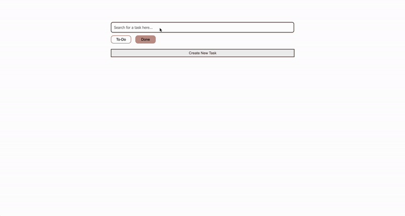

# Simple To-do Task List
Created for SMU .Hack's ReactJS introductory workshop. In 3 days, we learned the basics of frontend development, setting up basic backend controls with Node.js, as well as integration using axiosInstance .
 

## Considerations:
The mongodb database hosting all the tasks is a local database, so it it not downloadable for use. I am still learning MongoDB, so I hope to be able to integrate it with a basic cloud service using MongoDB Atlas.

